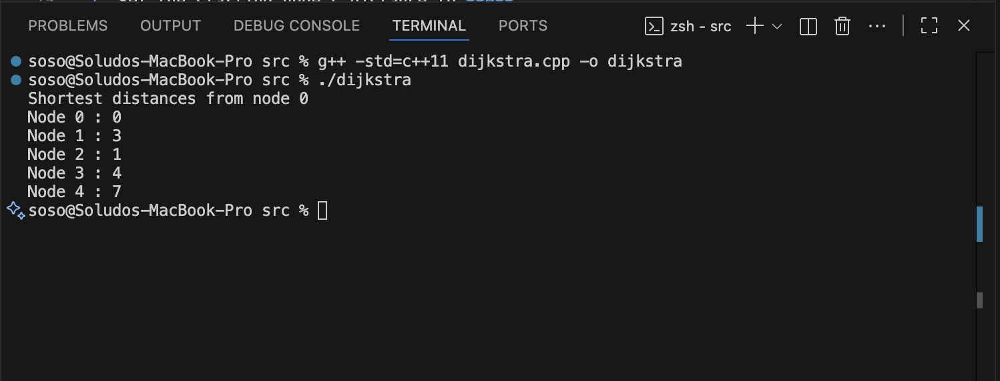

# Stable Matching (Gale–Shapley Algorithm)

## Overview

In this project I implemented the Stable Matching problem, also known as the Gale–Shapley algorithm.

The goal of the stable matching problem is to match two groups (for example men and women) in a way where there are no unstable pairs. An unstable pair would be two people who both prefer each other over the partners they were assigned.

The Gale–Shapley algorithm guarantees that a stable matching will always exist, and it provides a way to find that matching efficiently.

## How the Algorithm Works

The algorithm works by having one group propose to the other group until stable matches are formed.

The basic idea is:

1. All men start as free.
2. Each free man proposes to the highest ranked woman on his preference list that he has not proposed to yet.
3. If the woman is free, she accepts the proposal.
4. If she already has a partner, she compares the new proposal with her current partner.
5. She keeps the partner she prefers and rejects the other.
6. The rejected man becomes free again and continues proposing.

This process continues until every person has been matched.

At the end of the algorithm, the matching is stable, meaning there is no pair of people who would both prefer each other over their assigned partners.

## Time Complexity

The time complexity of the Gale–Shapley algorithm is O(n²).

Here, n represents the number of participants in each group.  
In the worst case, each person may need to propose to every member of the other group before a stable matching is reached.

## Implementation

The algorithm is implemented in C++.

The source code can be found in:

src/stable_matching.cpp

## What I Learned

While working on this implementation, I learned more about:

- how matching algorithms work
- how greedy strategies can be used to solve problems
- how preference lists affect the final matching
- why stable matchings are important in real applications

## Program Output

Below is a screenshot of the program running in VS Code.

